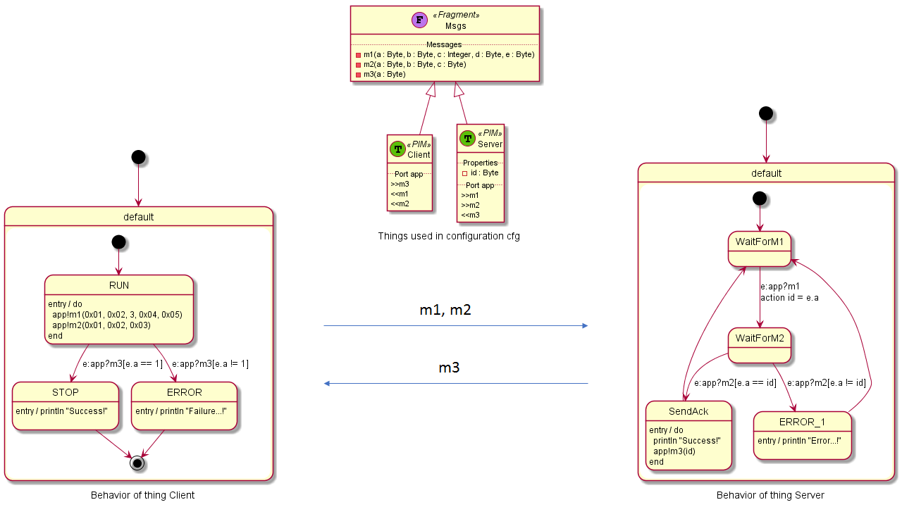

# thingml-diversifier

A model-based tool to automatically diversify communications.

## 1. Specify protocols

We model communication protocols as a set of communicating state-machines, encapsulated into components. 
We use [ThingML](https://github.com/TelluIoT/ThingML) to model those protocols. 

> It is probably a good idea to read the ThingML README first.

A protocol is typically composed of

1. A structural view, defining the API to be used by the client and the server
2. A behavioral view, specifying how messages are exchanged between the client and the server

### Structural view

The structural view basically defines the messages to be exchanged between the client and the server.
This is specify like this:

```
import "datatypes.thingml" from stl

//The messages to be exchanged by the client and the server
thing fragment Msgs {
   message m1(a:Byte,b:Byte,c:Integer,
              d:Byte,e:Byte)
   message m2(a:Byte,b:Byte,c:Byte)
   message m3(a:Byte)
}
```

### Behavioral view 

The behavior view is composed of two state machines. One for the client and one for the server. The example described below is also available [here](https://github.com/SINTEF-9012/thingml-diversifier/tree/master/docs/mymodel.thingml).

A simple client:
```
thing Client includes Msgs {
    
    required port app {
        sends m1, m2
        receives m3
    }

    statechart init RUN {        
        state RUN {
            on entry do
                app!m1(0x01, 0x02, 3, 0x04, 0x05)
                app!m2(0x01, 0x02, 0x03)
            end
            
            transition -> STOP
            event e : app?m3
            guard e.a == 1
            
            transition -> ERROR
            event e : app?m3
            guard e.a != 1
        }
        
        final state STOP {
            on entry println "Success!"
        }
        
        final state ERROR {
            on entry println "Failure...!"
        }
    }
}
```

A simple server:
```
thing Server includes Msgs {
    
    property id : Byte

    provided port app {
        receives m1, m2
        sends m3
    }

    statechart init WaitForM1 {                
        state WaitForM1 {
            transition -> WaitForM2
            event e : app?m1
            action id = e.a
        }
            
        state WaitForM2 {
            transition -> SendAck
            event e : app?m2
            guard e.a == id
            
            transition -> ERROR
            event e : app?m2
            guard e.a != id
        }
            
        state SendAck {
            on entry do
                println "Success!"
                app!m3(id)
            end
                
            transition -> WaitForM1
        }
        
        state ERROR {
            on entry println "Error...!"
                
            transition -> WaitForM1
        }        
    }
}
```

Congratulations! You have implemented the following protocol:



## 2. Diversify protocols

1. `cd thingml-diversifier`
2. `mvn clean install`
3. `cd target`
4. `java -jar thingml.diversifier-1.0.0-SNAPSHOT-jar-with-dependencies.jar` with the following parameters:

    - *input model* (a valid ThingML file). Mandatory.
    - *number* of diversified model to generate. Optional. Default = 1
    - *output directory* to store diversified models. Optional. Default = current directory
    - *random seed* to generate repeatable outputs. Optional. Default = a magic random seed (likely to be different every time)
    
For example: 

`java -jar thingml.diversifier-1.0.0-SNAPSHOT-jar-with-dependencies.jar mymodel.thingml 100 /tmp/thingml-diversifier 1`
    
## 3. Compile

Please have a look at the [ThingML README](https://github.com/TelluIoT/ThingML), explaining how to compiler models to different platforms: 

- C (Arduino and Linux)
- Java
- JavaScript (Node.JS and Browser)
- Go
- UML (PlantUML diagrams)

## 4. Evaluate the results

TODO: @jakhog